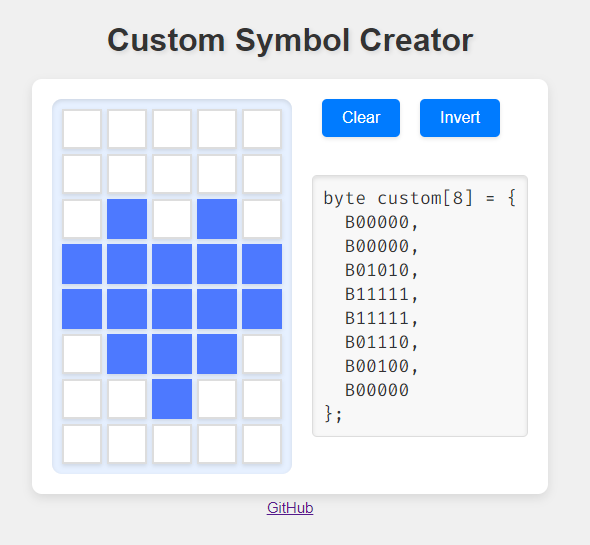
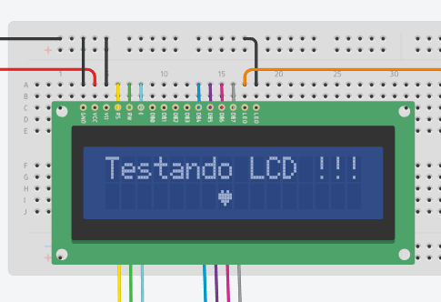

# Custom Character Creator
Criador de Símbolos Customizados para Display LCD 16x2 do Arduino! Este projeto permite que os usuários criem facilmente símbolos personalizados para o display LCD, clicando em uma matriz 5x8. A ferramenta oferece uma interface intuitiva para o design de símbolos e gera automaticamente o array de bytes correspondente para uso em projetos Arduino.




## :dart: Funcionalidades
- **Disponibilidade**: A aplicação está disponível via [GitHub Pages](https://alfredosavi.github.io/customCharacter/).
- **Matriz Interativa**: Grade 5x8 clicável para projetar símbolos personalizados.
- **Saída em Tempo Real**: Exibe o array de bytes gerado para fácil cópia e colagem no seu código Arduino.
- **Limpar e Inverter**: Botões para limpar a matriz ou inverter a seleção atual.


## 🔥 Uso
1. Entre no **GitHub Pages** do [projeto](https://alfredosavi.github.io/customCharacter/).
2. Clique nas células na grade 5x8 para ativar ou desativar os bits.
3. O array de bytes gerado será exibido na seção de saída.
4. Use o botão **Limpar** para resetar a matriz.
5. Use o botão **Inverter** para inverter a seleção atual.
6. Copie o código gerado e cole no seu projeto Arduino.
    


## :warning: Exemplo
Aqui está um exemplo de como usar o array de bytes gerado no seu sketch Arduino:
```cpp
#include <LiquidCrystal.h>

// Inicializa a biblioteca com os números dos pinos da interface
LiquidCrystal lcd(12, 11, 10, 5, 4, 3, 2);

int backLight = 13;

// Array de bytes do símbolo customizado
byte custom[8] = {
  B00000,
  B00000,
  B01010,
  B11111,
  B11111,
  B01110,
  B00100,
  B00000
};

void setup() {
  	pinMode(backLight, OUTPUT);
  	digitalWrite(backLight, HIGH);	// Liga backlight. Substituir 'HIGH' por 'LOW' para desligar a luz de fundo.
	
  
    lcd.begin(16, 2);
  
  	lcd.clear();                    // Inicializa o display com uma tela vazia
  	lcd.setCursor(0, 0);            // Posiciona o cursor na coluna 0, linha 0 (primeira linha)
  	lcd.print("Testando LCD !!!");  // Escreve o texto desejado
  
    lcd.createChar(0, custom);
    lcd.setCursor(7, 1);
    lcd.write(byte(0));
}

void loop() {
    // Seu código aqui
}
```



<a id="ancora3"></a>
## :link: Links Úteis

1. [Createchar liquidcrystal lib](https://www.arduino.cc/reference/en/libraries/liquidcrystal/createchar/)


## ⚡️ Como contribuir
- Faça um fork desse repositório;
- Cria uma branch com a sua feature: `git checkout -b minha-feature`;
- Faça commit das suas alterações: `git commit -m 'feat: Minha nova feature'`;
- Faça push para a sua branch: `git push origin minha-feature`.

Depois que o merge da sua pull request for feito, você pode deletar a sua branch.


## :memo: Licença
Esse projeto está sob a licença MIT. Veja o arquivo [LICENSE](../LICENSE) para mais detalhes.